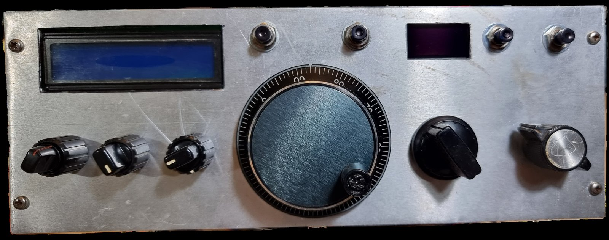

# Atlas 210X — Si5351 VFO, S-meter, DSP filter control and front plate

Restoration and modernisation of an **Atlas 210X** HF SSB transceiver (1970s) by **YT3CT** (ex YU5KBM).

The original VFO and carrier oscillator are replaced by an **Si5351** controlled by an **Arduino Nano**
with a 16×2 LCD, encoder tuning, band switch reading and a calibrated digital S-meter. A second Nano
controls a **SOTABEAMS VariBeam** audio DSP filter with its own OLED. A new 3D-printed front plate
holds both displays, a CNC-style tuning knob (MBL600) and extra buttons.

## Repository layout

| Folder | Contents |
|---|---|
| [`firmware/atlas_vfo_fixed`](firmware/atlas_vfo_fixed) | VFO Nano sketch (current) |
| [`firmware/VB_LocalDisplay_fixed`](firmware/VB_LocalDisplay_fixed) | VariBeam DSP control Nano sketch (current) |
| [`firmware/original_2023`](firmware/original_2023) | The 2023 versions, for reference |
| [`3d`](3d) | Front plate STL (original and corrected) + Python scripts used to measure and fix it |
| [`docs`](docs) | Project status / measurements, A4 wiring sheet (PDF + HTML) |
| [`tools`](tools) | PowerShell helpers: upload over a CH340 port when avrdude fails, serial reader, bootloader check, flash backup; 2023 firmware backup |
| [`photos`](photos) | Build photos (resized, metadata removed) |

## VFO Nano (`atlas_vfo_fixed.ino`)

Board: Arduino Nano, **ATmega328P (Old Bootloader)**. Libraries: Etherkit Si5351, LiquidCrystal,
Ben Buxton's Rotary.

- Si5351 CLK0 = LO (RF ± IF), CLK1 = BFO / carrier oscillator. IF 5.520 MHz crystal filter.
- **Calibration:** CORR = +101000 ppb (the Si5351 crystal is ~101 ppm high), BFO = 5.520000 MHz —
  checked against an FTdx10 and a tinySA (±10 Hz, opposite sideband suppressed).
- **I²C timeout** (`Wire.setWireTimeout`) — an RF glitch on SDA/SCL can no longer freeze the VFO;
  the Si5351 is re-programmed and a `!` is shown on the LCD.
- Encoder ISR only counts steps, band switch with hysteresis, last frequency per band kept while
  running, last frequency saved in EEPROM and restored at power on,
  RIT removed on TX, setup menu (hold the encoder button at power on: BFO / CORR).
- **Digital S-meter**: differential reading of the Atlas S-meter bridge (PC-100 pins 15/16 →
  A1/A0 through 10 k + 100 nF, 1 k across the bridge in place of the removed meter), calibrated with a
  tinySA from S6 to S9+40. LCD: 9 fields = S1…S9 (two lines per field = 3 dB), then `+10`…`+40`.
- Serial status line at 19200 baud: band, ADC values, S-meter mV/dB, frequency, TX, I²C timeouts.

## VariBeam DSP control Nano (`VB_LocalDisplay_fixed.ino`)

Based on KG4RUL's VariBeam local display sketch (MIT licence, header kept).
Libraries: Adafruit GFX + Adafruit SH110X.

- Fixed: emulated encoder states now held 2 ms (the VariBeam missed steps), counted detents,
  OLED reset pin clash with the encoder switch, SH1106 column offset.
- Splash screen and **resync at power on** (VariBeam driven to its minimum, then to the saved values),
  settings saved in EEPROM, passband edges + trapezoid passband graph.
- Button: 1× CF/BW, 2× preset (SSB / SSB NARROW / CW / DIGI), 3× screen when idle (OFF / DIM /
  ALWAYS ON — OLEDs make RF hash even when idle), hold 2 s = resync.

## Receiver work (summary)

See [`docs/status.md`](docs/status.md) for all measurements. Highlights:

- Dirty DC switching relay (PC-100) cleaned — big gain improvement.
- Old dipped tantalums replaced on PC-200 / PC-300; AGC threshold pot (R309, PC-300D) replaced by a
  5 k multi-turn, S-meter zero (R222, PC-200) by a 1 k multi-turn.
- AGC now 4.53 V idle → 5.25 V at −73 dBm on PC-200 pin 19 (factory 4.53 → 5.16 V).
- Loose 20 m image filter coil form on the chassis found (glue the form, re-tune for minimum image).

## Front plate (3D print)

[`3d/Atlas 210 - final.stl`](3d) — 239 × 88 × 9 mm, ready to print (`Atlas 210 - original.stl` is the
first design for comparison). Corrected from the original design:

- **MBL600** 60 mm encoder: recess Ø61.8, through hole Ø44.4, 3 × Ø3.8 at 120° on PCD 50.8.
- **2 × 0.96" SSD1306 OLED**: window 23 × 12, pocket 27.8 × 28.4.
- **16×2 LCD**: window 65 × 15 (pocket as designed, PCB flush with the top edge).

## Wiring

[`docs/wiring_A4.pdf`](docs/wiring_A4.pdf) — one printable A4 page: LCD with 470 Ω series resistors
and decoupling, TTL programming leads, button ladder on A6 (ATT / MODE / AGC / spare), RX
attenuator relay, AGC fast/slow (planned).

## References (not included here)

The Atlas 210X/215X user manual / schematics and the *Atlas 210X/215X Engineering Supplement*
(ZL1UJG / W7KEC) were used heavily. They are copyrighted documents and are not part of this repository.

73 de YT3CT
